# Tp19 - Microservices Architecture

This project is a microservices-based application developed using Spring Boot and Spring Cloud. It demonstrates a system for managing Clients and Cars (Voitures) with Service Discovery and an API Gateway.

## Architecture Overview

The system consists of the following microservices:

1.  **Eureka Server**: Service Registry and Discovery server.
2.  **Gateway Service**: API Gateway that routes requests to the appropriate microservices.
3.  **Client Service**: A service responsible for managing Client data.
4.  **Voiture Service**: A service responsible for managing Car data and interacting with the Client Service.

## Technologies Used

*   **Java**
*   **Spring Boot**
*   **Spring Cloud** (Eureka, Gateway, OpenFeign)
*   **H2 Database** (In-memory database)
*   **Maven**

## Service Details

| Service Name | Description | Port | Database |
| :--- | :--- | :--- | :--- |
| `eureka-server` | Service Discovery Server | **8761** | N/A |
| `gateway-service` | API Gateway | **8888** | N/A |
| `client-service` | Client Management Service | **8088** | H2 |
| `voiture-service` | Car Management Service | **8089** | H2 |

## Getting Started

### Prerequisites

*   Java Development Kit (JDK)
*   Maven

### Running the Services

It is recommended to start the services in the following order:

1.  **Eureka Server**:
    ```bash
    cd eureka-server
    mvn spring-boot:run
    ```
    Access Dashboard: `http://localhost:8761`

2.  **Gateway Service**:
    ```bash
    cd gateway-service
    mvn spring-boot:run
    ```

3.  **Client Service**:
    ```bash
    cd client-service
    mvn spring-boot:run
    ```

4.  **Voiture Service**:
    ```bash
    cd voiture-service
    mvn spring-boot:run
    ```

## API Endpoints

You can access the services through the **Gateway Service** running on port `8888`. The Gateway uses dynamic routing based on the service name registered in Eureka.

### Client Service
*   **Get all clients:**
    `GET http://localhost:8888/CLIENT-SERVICE/clients`
*   **Get client by ID:**
    `GET http://localhost:8888/CLIENT-SERVICE/client/{id}`

### Voiture Service
*   **Get all cars:**
    `GET http://localhost:8888/VOITURE-SERVICE/voitures`
*   **Get car by ID:**
    `GET http://localhost:8888/VOITURE-SERVICE/voiture/{id}`
*   **Get cars by Client ID:**
    `GET http://localhost:8888/VOITURE-SERVICE/voitures/client/{id}`
*   **Add a new car:**
    `POST http://localhost:8888/VOITURE-SERVICE/voitures/{clientId}`
*   **Update a car:**
    `PUT http://localhost:8888/VOITURE-SERVICE/voitures/{id}`

## H2 Console

Since the services use H2 in-memory database, you can access the database console for debugging:

*   **Client Service DB:** `http://localhost:8088/h2-console`
    *   JDBC URL: `jdbc:h2:mem:clientdb`
*   **Voiture Service DB:** `http://localhost:8089/h2-console`
    *   JDBC URL: `jdbc:h2:mem:voituredb`
*   **User:** `sa`
*   **Password:** (Empty)


## Images

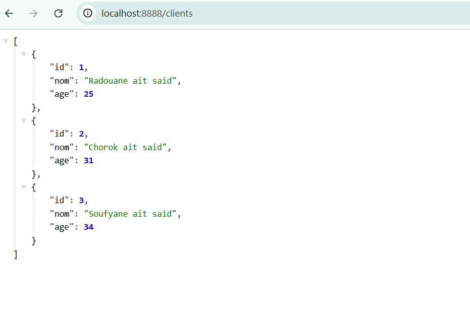
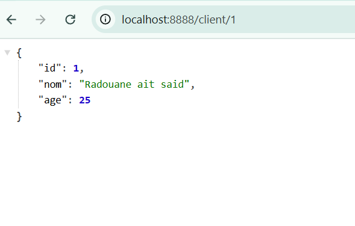
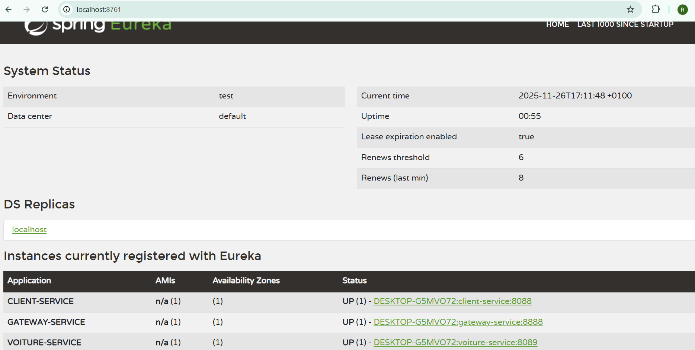
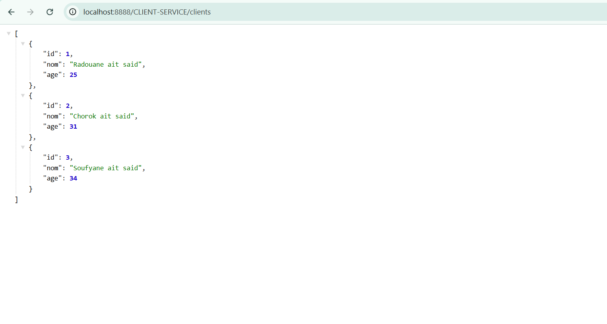
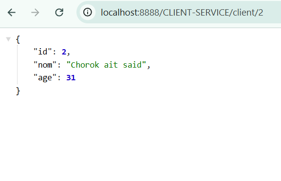
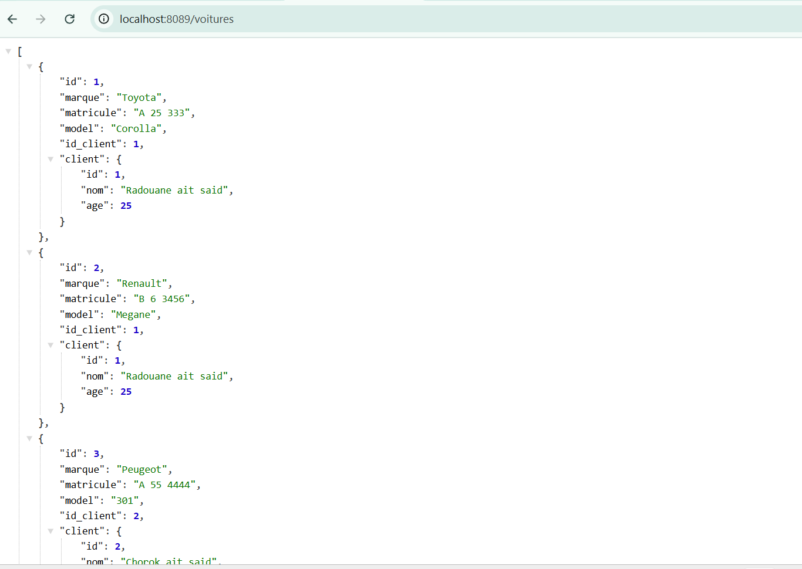
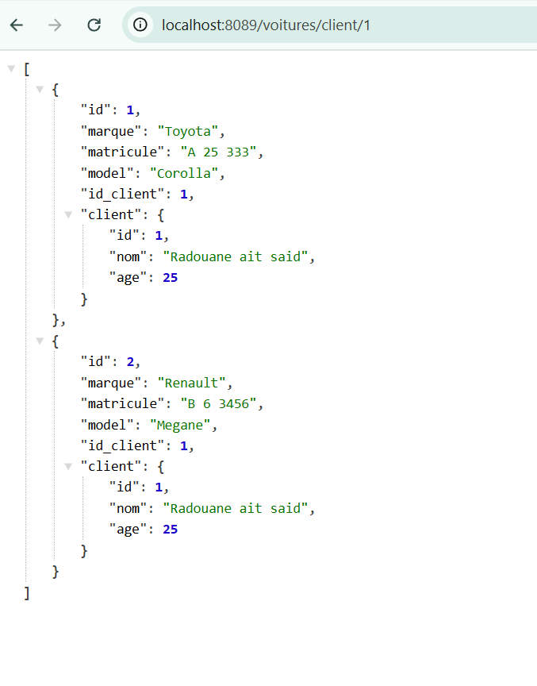
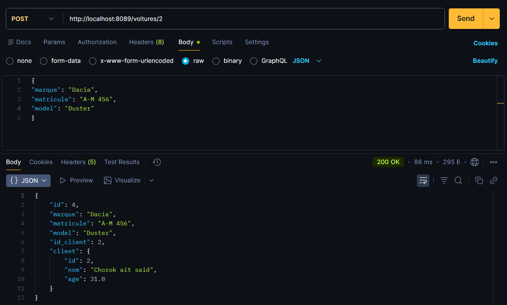
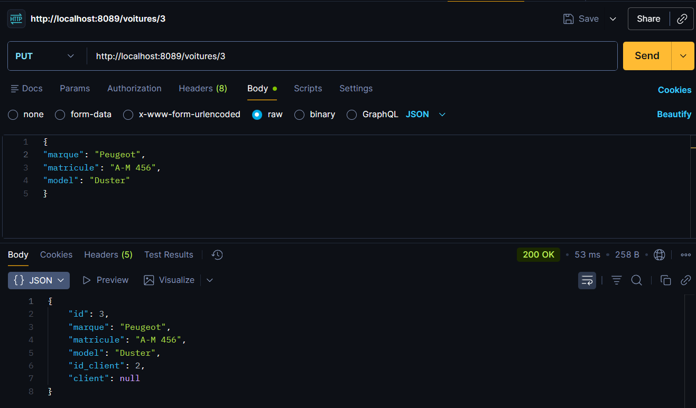
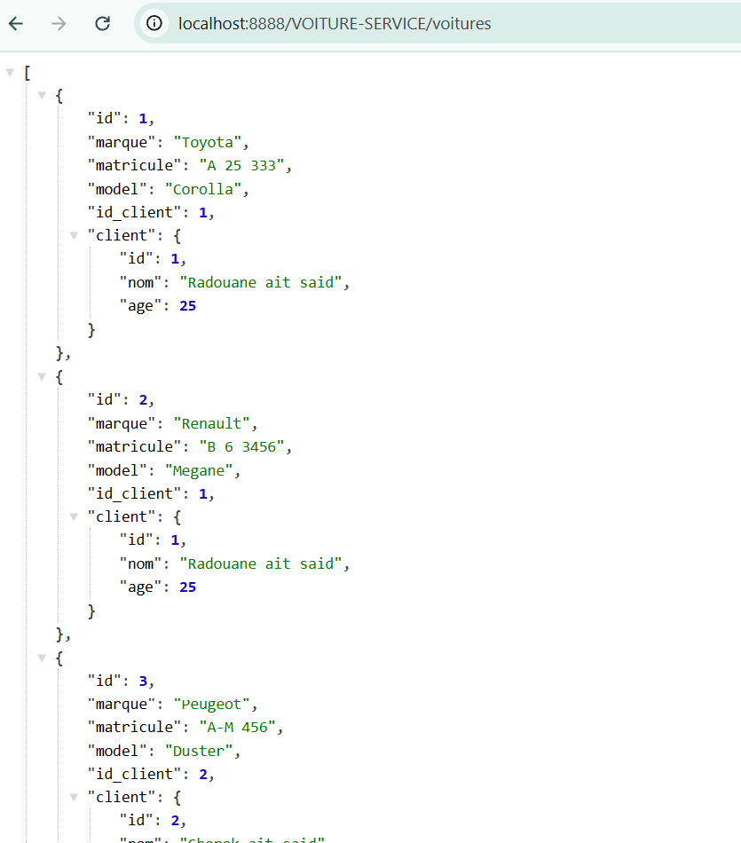
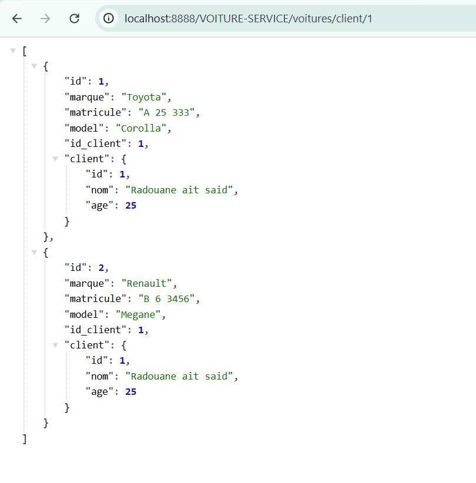
